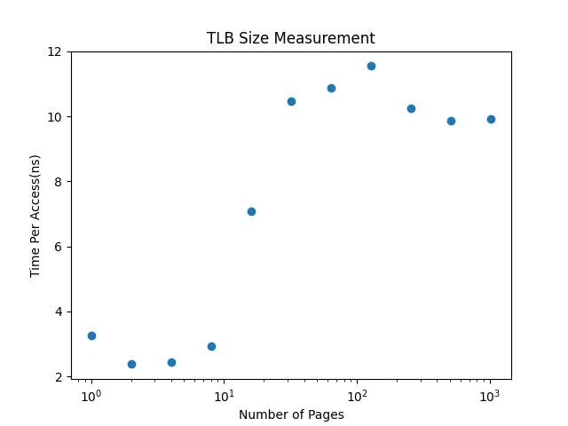

# My Solutions

## Results

### Q1: Use gettimeofday

A more suitable option would be `clock_gettime`, because it has better resolution.

### Q2: Write tlb.c

To get the page size on a Mac, use the command: `getconf PAGESIZE`.

### Q3: Reliable result?

The reliability of the result depends on the granularity of the time function used. On my computer, `clock_gettime` resolution is 1 microsecond (10E-6). Given that per page access is around a few nanoseconds in the case of a small number of pages, it would be better to run trials 10E3 times to get a reliable result.

### Q4: Why does visualization make data easier to digest?

Visualization allows us to observe trends in the data more clearly and quickly.

### Q5: Compiler optimization

By default, `-O0` omits optimizations such as loop unrolling and register allocation, but this can depend on compilers and vendors. To be absolutely certain about this, use `volatile`.

### Q6: Pinning thread

Currently, I'm not sure if we can ensure this on a Mac.

### Q7: Balancing potential costs of initialization and zero-demanding

Zero-demanding is a memory management technique where a page of memory is not allocated and zeroed out until a process actually needs to use it. If we do not initialize, then it would be best to initialize one element per page.